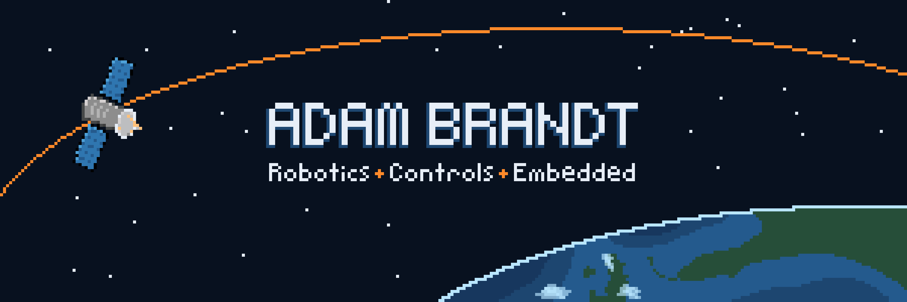

  

  <a href="https://abrandt.xyz">Portfolio</a>
  ·
  <a href="https://www.linkedin.com](https://www.linkedin.com/in/adam-k-brandt/">LinkedIn</a>

---

## About Me

I'm a Computer Science and Mechanical Engineering student at the University of Central Florida.

I enjoy working on systems where software interacts directly with hardware, especially robotics, controls, embedded systems, telemetry, and launch/test infrastructure.

Most of my work involves some combination of sensing, estimation, control, networking, and building the software needed to make physical systems behave reliably.

## Currently

- Working on robotics and autonomous systems with **Daydream Robotics**
- Building launch and test infrastructure with **Knights Experimental Rocketry**
- Exploring controls, localization, embedded systems, and flight hardware
- Occasionally starting side quests that become significantly larger than intended

## Technologies

### Favorite Languages
`C++` `Python`

---

  <i>Building software for things that move, fly, and occasionally refuse to cooperate.</i>

